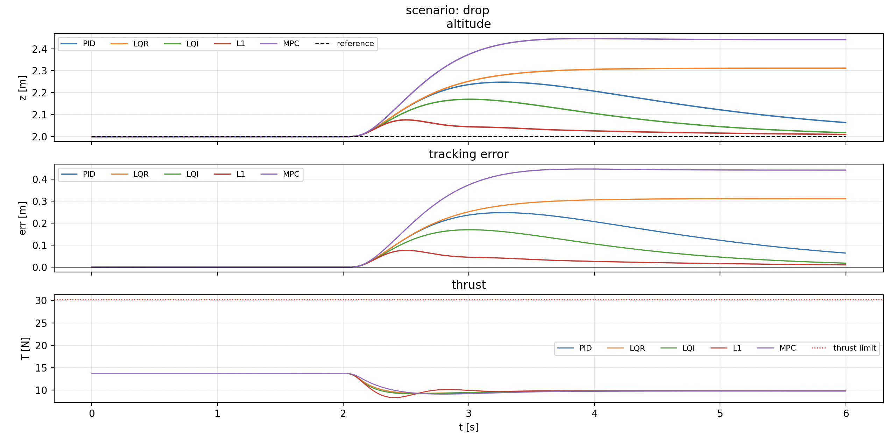
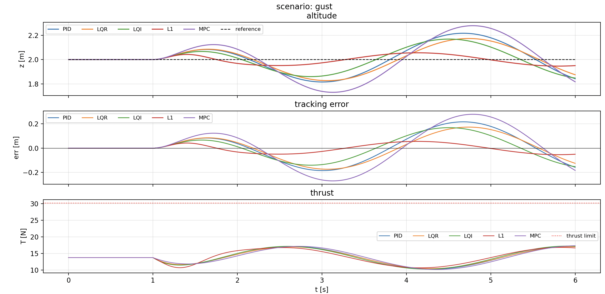
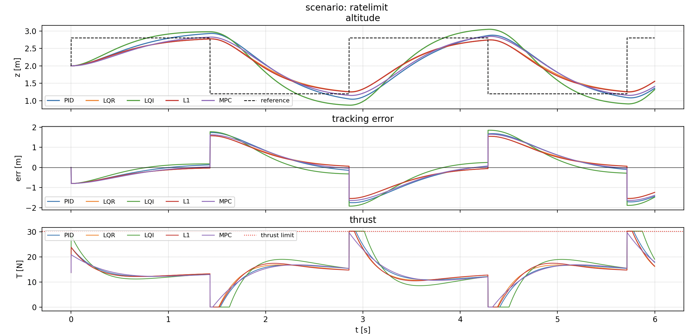

use ml as conda baseline

## Results

Five controllers, matched to identical closed-loop bandwidth (ωₙ = 3 rad/s, ζ = 0.9) so the comparison reflects controller structure rather than tuning effort.

### Steady-state error [m]

| scenario | PID | LQR | LQI | L1 | MPC |
|---|---|---|---|---|---|
| drop | 0.0904 | 0.3113 | 0.0299 | **0.0129** | 0.4415 |
| climb | 0.1683 | 0.0000 | 0.0755 | 0.0030 | **0.0012** |
| gust | **0.0121** | 0.0201 | 0.0378 | 0.0388 | 0.0536 |
| noise | 0.0005 | 0.0003 | 0.0003 | **0.0001** | 0.0004 |
| ratelimit | 0.3375 | 0.2379 | 0.5481 | **0.2519** | 0.3014 |

### RMS error [m]

| scenario | PID | LQR | LQI | L1 | MPC |
|---|---|---|---|---|---|
| drop | 0.1372 | 0.2233 | 0.0824 | **0.0282** | 0.3222 |
| climb | 0.8643 | 0.8206 | 0.8507 | **0.7918** | 0.8187 |
| gust | 0.1128 | 0.0975 | 0.0897 | **0.0342** | 0.1522 |
| noise | 0.0007 | 0.0006 | 0.0008 | **0.0004** | 0.0006 |
| ratelimit | 0.8991 | 0.8027 | 0.8996 | **0.7968** | 0.8652 |

### Actuator saturation [% of time]

| scenario | PID | LQR | LQI | L1 | MPC |
|---|---|---|---|---|---|
| climb | 4.0 | 3.4 | 5.9 | 4.7 | **2.6** |
| ratelimit | 6.0 | 4.9 | 12.2 | 5.1 | **1.2** |
